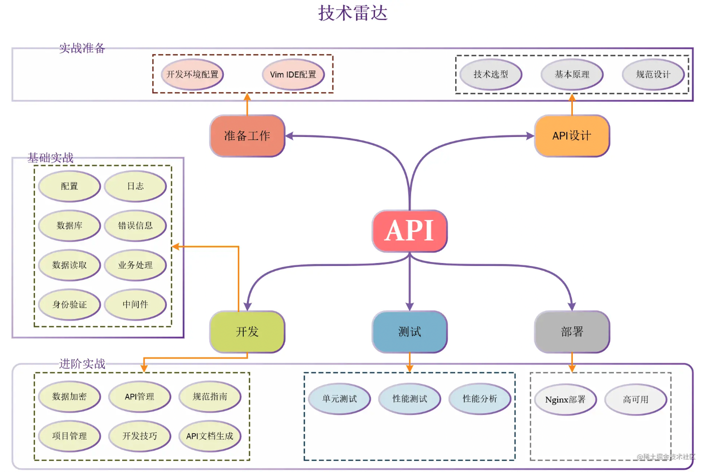

# api-server
本项目是掘金课程<<基于 Go 语言构建企业级的 RESTful API 服务>>的代码实现
## 功能特性
api-server是一个企业级RESTful API服务
通过实现一个账号系统,构建了一个真实的API服务器
## 软件架构

## 快速开始

### 依赖检查
1. 操作系统: CentOS Linux 8.x (64-bit)
### 构建
1. 在项目根路径下,```make``` 
### 运行
```./apiserver```